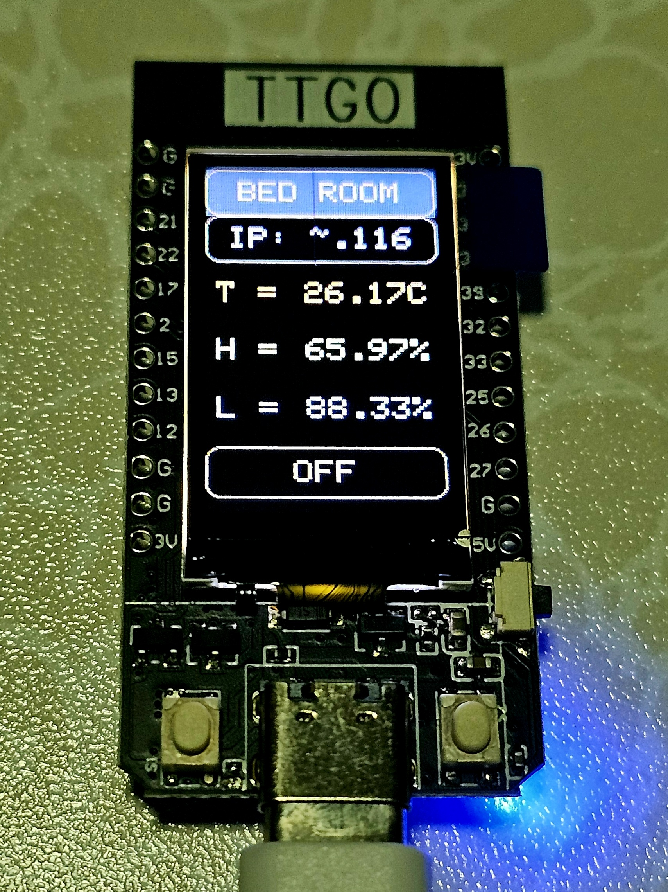
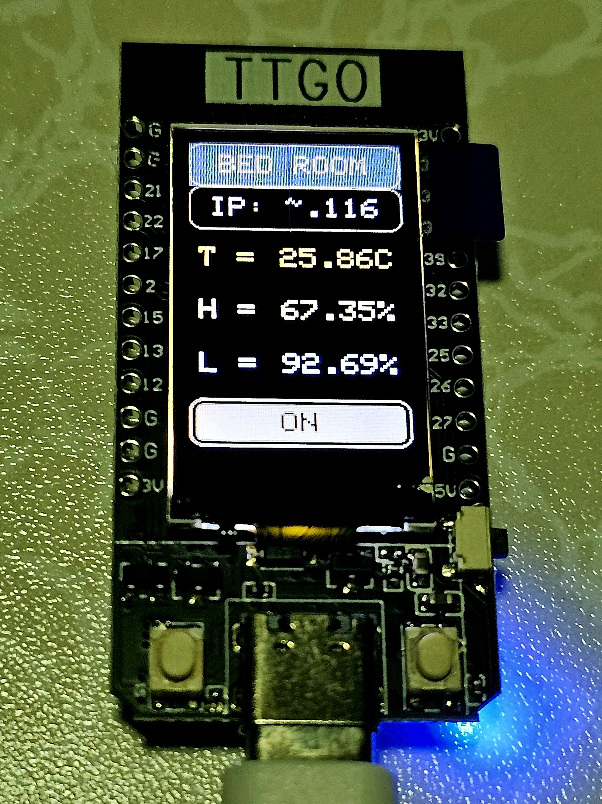
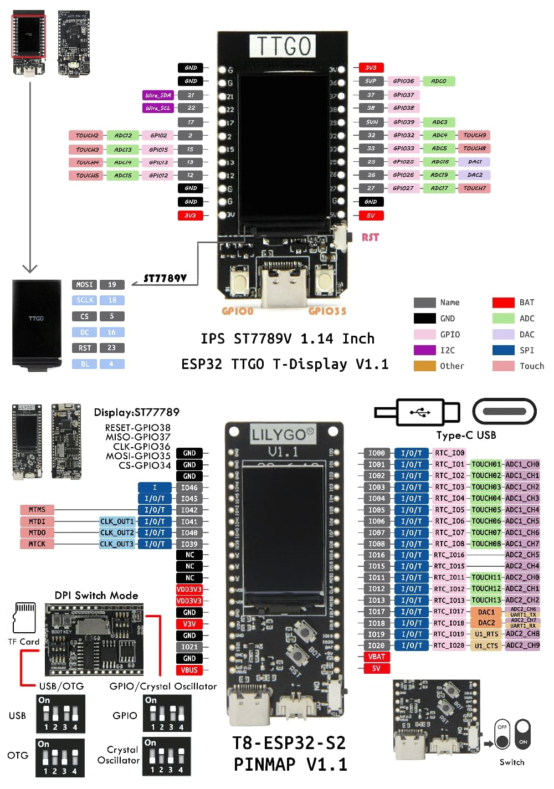

# bed-sensors — Reproducible Project Specification

> Paste this document into any generative AI and ask it to produce the two files:
> `platformio.ini` and `src/main.cpp`.
> The result should be a complete, compilable PlatformIO project with no other source files needed.

---

## Goal

Firmware for a **LILYGO T-Display** (ESP32) that reads bedroom environmental sensors, shows live values on the built-in TFT display, and publishes them to an MQTT broker over Wi-Fi. A physical relay is toggled by a button and controlled remotely via MQTT. The display sleeps after 5 minutes of inactivity and wakes on button press or MQTT relay command. Everything must fit in a single `src/main.cpp` file.

---

## Platform & Board

| Key | Value |
|---|---|
| PlatformIO platform | `espressif32` |
| Board | `lilygo-t-display` |
| Framework | `arduino` |
| Serial monitor speed | `115200` |

---

## Libraries (declare in `platformio.ini` `lib_deps`)

```
adafruit/DHT sensor library
adafruit/Adafruit Unified Sensor
bodmer/TFT_eSPI
knolleary/PubSubClient
```

---

## TFT Build Flags (declare in `platformio.ini` `build_flags`)

TFT_eSPI must be configured entirely via build flags — no `User_Setup.h` file.

```
-DUSER_SETUP_LOADED=1
-DST7789_DRIVER=1
-DTFT_WIDTH=135
-DTFT_HEIGHT=240
-DTFT_MOSI=19
-DTFT_SCLK=18
-DTFT_CS=5
-DTFT_DC=16
-DTFT_RST=23
-DTFT_BL=4
-DTFT_BACKLIGHT_ON=HIGH
-DLOAD_GLCD=1
-DLOAD_FONT2=1
-DLOAD_FONT4=1
-DLOAD_GFXFF=1
-DSMOOTH_FONT=1
-DSPI_FREQUENCY=40000000
```

---

## Hardware & Pin Assignments

| Signal | GPIO | Notes |
|---|---|---|
| LDR analog input | 36 | ADC1_CH0 |
| DHT22 data | 12 | Only compiled when `SIMULATE_SENSORS 0` |
| TFT backlight | 4 | Also declared via build flag `-DTFT_BL=4` |
| Relay output | 13 | Active-low — `LOW` = relay ON, `HIGH` = relay OFF |
| Button input | 35 | Built-in right button; external pull-up on TTGO T-Display, active-low |

- **DHT22** — temperature + humidity sensor
- **LDR** — photoresistor wired as a voltage divider; `analogRead` returns 0–4095; convert to 0–100 %
- **Relay** — active-low; drive `HIGH` at boot (off). Toggle with button press or MQTT command.

---

## Configuration Constants (hardcoded `#define` in `main.cpp`)

```cpp
#define SIMULATE_SENSORS 1       // 1 = simulated random walk, 0 = real DHT22 + LDR

#define WIFI_SSID "<ssid>"
#define WIFI_PASS "<pass>"

#define MQTT_SERVER "<emqx.serv.ip.addr>"
#define MQTT_PORT   1883

#define UPDATE_MS   2000         // sensor read + display refresh interval in ms
#define SLEEP_MS    300000UL     // 5 minutes of inactivity before display sleep
```

---

## Pastel Colour Palette (RGB565, defined as `#define`)

Do not use the generic `TFT_*` colour names for these rows — use the custom constants below.

| Constant | RGB565 hex | Approximate colour | Used for |
|---|---|---|---|
| `COL_HDR_BG` | `0x3AD0` | Slate blue `#3D5A80` | Header background |
| `COL_IP_OK` | `0xCD5D` | Soft lavender `#C8A8E8` | IP row when connected |
| `COL_IP_FAIL` | `0xE410` | Soft coral `#E08080` | IP row when offline |
| `COL_TEMP` | `0xFD0F` | Light salmon `#FFA07A` | Temperature text |
| `COL_HUMID` | `0xAED5` | Soft mint `#A8D8A8` | Humidity text |
| `COL_LIGHT` | `0x867D` | Sky blue `#87CEEB` | Light text |
| `COL_BORDER` | `0xB596` | Soft gray `#B0B0B0` | Rounded-rect borders and fallback text |
| `COL_RELAY_ON` | `0x8410` | Medium gray `#808080` | Relay toggle fill when ON |

---

## Sensor Simulation (used when `SIMULATE_SENSORS 1`)

Apply a random walk every `UPDATE_MS` with these constraints:

| Variable | Step per tick | Clamped range |
|---|---|---|
| `temperature` (float, °C) | ±0.49 °C | 20.0 – 30.0 |
| `humidity` (float, %RH) | ±1.99 % | 60.0 – 80.0 |
| `lightPct` (float, %) | ±5.0 % | 0.0 – 100.0 |

Initial values: `temperature = 25.0`, `humidity = 70.0`, `lightPct = 50.0`.

Seed `randomSeed(analogRead(0))` once in `setup()`.

---

## Real Sensor Reads (used when `SIMULATE_SENSORS 0`)

- `#include <DHT.h>` only inside the `#if !SIMULATE_SENSORS` block.
- Read DHT22 with `dht.readTemperature()` and `dht.readHumidity()`; skip update if `isnan()`.
- Read LDR: `lightPct = analogRead(LDR_PIN) / 4095.0f * 100.0f`

---

## TFT Display Layout (portrait, 135 × 240 px, rotation 0)

Text size 2 throughout unless noted.

### Static header (drawn once after boot, and on screen wake)

| Y range | Content | Style |
|---|---|---|
| 0 – 33 | Header bar — static text `"BED ROOM"`, horizontally centered (`MC_DATUM`) | White text (`COL_BORDER`) on `COL_HDR_BG` fill, rounded-rect border `COL_BORDER` radius 8 |

### Dynamic rows (redrawn every `UPDATE_MS` tick)

Each row clears its own rectangle with `TFT_BLACK` before redrawing.

| Y start | Height | Content | Alignment | Colour |
|---|---|---|---|---|
| 34 | 34 | IP row — `"IP: ~.<last_octet>"` when connected, `"No WiFi"` when not; rounded-rect border | `MC_DATUM` centered at y+17 | `COL_IP_OK` / `COL_IP_FAIL` |
| 79 | 22 | Temperature — label `"T ="` left, value `"25.00C"` right | `TL_DATUM` at x=6; `TR_DATUM` at x=129 | `COL_TEMP` |
| 119 | 22 | Humidity — label `"H ="` left, value `"70.00%"` right | same | `COL_HUMID` |
| 159 | 22 | Light — label `"L ="` left, value `"50.00%"` right | same | `COL_LIGHT` |
| 196 | 34 | Relay toggle graphic (see below) | `MC_DATUM` centered | `COL_BORDER` / `COL_RELAY_ON` |

### Relay toggle graphic (`drawRelayToggle()`)

- Outer rounded rect: x=0, y=196, w=135, h=34, radius=8, border `COL_BORDER`; clear 36 px tall (rect + 2 px bottom gap) before redraw.
- **OFF**: border only, text `"OFF"` in `COL_BORDER` on `TFT_BLACK`.
- **ON**: filled inset rect (4 px margin all sides, radius 4) with `COL_RELAY_ON`; text `"ON"` in `TFT_BLACK` on `COL_RELAY_ON`.

### Boot sequence

Show `"Starting..."` centered at (67, 120) on black screen. Wait 2 s. Clear screen. Draw static header.

---

## Display Helper Functions

```cpp
void drawHeader()                                        // static header bar
void drawIPRow()                                         // IP / no-WiFi row
void drawSensorRow(int y, uint16_t color,
                   const char *label, const char *value) // one sensor row
void drawRelayToggle()                                   // relay ON/OFF graphic
void drawUI()                                            // calls drawIPRow + all sensor rows + relay
```

`drawUI()` calls `drawIPRow()`, `drawSensorRow(79, …)`, `drawSensorRow(119, …)`, `drawSensorRow(159, …)`, then `drawRelayToggle()`.

---

## MQTT Topics

| Direction | Topic | Payload |
|---|---|---|
| Publish | `home/bed/dht/temp` | temperature, formatted `"%.2f"` |
| Publish | `home/bed/dht/humid` | humidity, formatted `"%.2f"` |
| Publish | `home/bed/ldr/light` | lightPct, formatted `"%.2f"` |
| Publish | `home/bed/button/relay` | `"on"` or `"off"` (relay state) |
| Subscribe | `home/bed/control/relay` | `"on"` / `"off"` to toggle relay remotely |

MQTT client ID: `"bed-sensors"` (no username/password).

On connect, subscribe to `home/bed/control/relay`.

---

## MQTT Publish Timing

Each sensor topic (`temp`, `humid`, `light`) has its **own independent timer**. After each publish the next interval is `random(28000, 32001)` ms (~30 s average). All three timers start at 0 (publish immediately on first connect).

The relay state topic (`home/bed/button/relay`) is published:
- **Immediately** whenever `relayChanged` is `true` (button press or MQTT command received).
- **Periodically** every `random(118000, 122001)` ms (~2 min heartbeat).

---

## MQTT Incoming Message Handler (`mqttCallback`)

Payload comparisons are case-insensitive (`strncasecmp`).

- If topic is `home/bed/control/relay` and payload is `"on"` (len 2): set `relayOn = true`, drive relay pin `LOW`.
- If topic is `home/bed/control/relay` and payload is `"off"` (len 3): set `relayOn = false`, drive relay pin `HIGH`.
- Set `relayChanged = true` after any change.
- If screen is sleeping, wake it: set `screenOn = true`, drive `TFT_BL_PIN HIGH`, call `drawHeader()`.
- Update `lastActivityMs = millis()` and call `drawUI()`.

---

## Screen Sleep / Wake

- Global state: `bool screenOn = true`, `unsigned long lastActivityMs = 0`.
- In `loop()`: if `screenOn && (millis() - lastActivityMs > SLEEP_MS)` → set `screenOn = false`, drive `TFT_BL_PIN LOW`.
- **Wake on button press** (GPIO 35 LOW): set `screenOn = true`, drive `TFT_BL_PIN HIGH`, call `drawHeader()` + `drawUI()`.
- **Wake on MQTT relay command**: handled inside `mqttCallback` (see above).

---

## Button Logic (GPIO 35, debounce 50 ms)

Track `prevBtn`, `stableBtn`, `debounceTime` as `static` locals.

On falling edge (button pressed, `stableBtn == LOW`):
1. Update `lastActivityMs`.
2. If `!screenOn` → wake screen (see above), do **not** toggle relay.
3. Else → toggle `relayOn`, set `relayChanged = true`, drive relay pin accordingly, call `drawUI()`.

---

## Reconnection Logic

- **MQTT**: if disconnected and Wi-Fi is up, attempt `mqtt.connect()` at most once every 5 s.
- **Wi-Fi**: if `WiFi.status() != WL_CONNECTED`, call `WiFi.disconnect()` then `WiFi.begin()` at most once every 10 s.
- Neither reconnect attempt blocks; use `millis()` guards with `static` local variables.

---

## Serial Logging

Every `UPDATE_MS` tick, print one line:

```
[SCREEN] T=<temp>°C  H=<humid>%  L=<light>%  Relay=<ON|OFF>  WiFi=<IP or "no">
```

On every sensor MQTT publish (via `mqttPublish` helper):

```
[MQTT] <topic> => <value>
```

On relay publish (inline in `mqttLoop`):

```
[MQTT] home/bed/button/relay => <on|off> (changed)
[MQTT] home/bed/button/relay => <on|off> (periodic)
```

On MQTT receive:

```
[MQTT] rx  <topic> => <payload>
[RELAY] <ON|OFF> (MQTT)
```

On button relay toggle:

```
[RELAY] <ON|OFF>
```

On screen state changes:

```
[SCREEN] ON  (wake)
[SCREEN] OFF (sleep)
[SCREEN] ON  (MQTT wake)
```

On MQTT connect:

```
[MQTT] connected => subscribed home/bed/control/relay
[MQTT] connect failed, rc=<rc>
```

---

## Code Structure Requirements

- Single file: `src/main.cpp`
- Use `#if / #else / #endif` preprocessor blocks to switch between simulated and real sensor code — do not use runtime branching for this. The DHT `#include` and object declaration are also inside `#if !SIMULATE_SENSORS`.
- Display helpers: `drawHeader()`, `drawIPRow()`, `drawSensorRow(int y, uint16_t color, const char* label, const char* value)`, `drawRelayToggle()`, `drawUI()`.
- MQTT logic in `mqttLoop()` called from `loop()`.
- Button debounce and screen-sleep logic directly in `loop()` using `static` local variables.
- No RTOS tasks, no threads — single-core Arduino `setup()` / `loop()` pattern only.

---

## Photos

Bed Room Sensors (Relay Off)  


Bed Room Sensors (Relay On)  


Pinout Reference  

