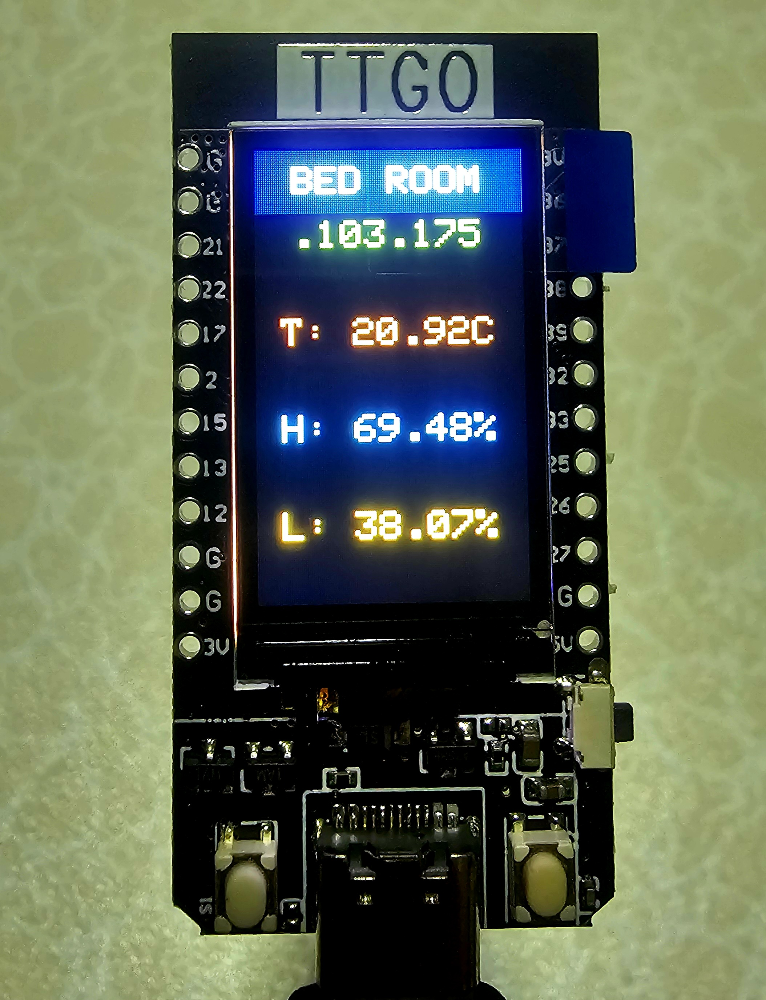

# bed-sensors — Reproducible Project Specification

> Paste this document into any generative AI and ask it to produce the two files:
> `platformio.ini` and `src/main.cpp`.
> The result should be a complete, compilable PlatformIO project with no other source files needed.

---

## Goal

Firmware for a **LILYGO T-Display** (ESP32) that reads bedroom environmental sensors, shows live values on the built-in TFT display, and publishes them to an MQTT broker over Wi-Fi. Everything must fit in a single `src/main.cpp` file.

---

## Platform & Board

| Key | Value |
|---|---|
| PlatformIO platform | `espressif32` |
| Board | `lilygo-t-display` |
| Framework | `arduino` |
| Serial monitor speed | `115200` |

---

## Libraries (declare in `platformio.ini` `lib_deps`)

```
adafruit/DHT sensor library
adafruit/Adafruit Unified Sensor
bodmer/TFT_eSPI
knolleary/PubSubClient
```

---

## TFT Build Flags (declare in `platformio.ini` `build_flags`)

TFT_eSPI must be configured entirely via build flags — no `User_Setup.h` file.

```
-DUSER_SETUP_LOADED=1
-DST7789_DRIVER=1
-DTFT_WIDTH=135
-DTFT_HEIGHT=240
-DTFT_MOSI=19
-DTFT_SCLK=18
-DTFT_CS=5
-DTFT_DC=16
-DTFT_RST=23
-DTFT_BL=4
-DTFT_BACKLIGHT_ON=HIGH
-DLOAD_GLCD=1
-DLOAD_FONT2=1
-DLOAD_FONT4=1
-DLOAD_GFXFF=1
-DSMOOTH_FONT=1
-DSPI_FREQUENCY=40000000
```

---

## Hardware & Pin Assignments

| Signal | GPIO |
|---|---|
| LDR analog input | 36 (ADC1_CH0) |
| DHT22 data | 12 |
| TFT backlight | 4 |

- **DHT22** — temperature + humidity sensor
- **LDR** — photoresistor wired as a voltage divider; `analogRead` returns 0–4095; convert to 0–100 %

---

## Configuration Constants (hardcoded `#define` in `main.cpp`)

```cpp
#define SIMULATE_SENSORS 1       // 1 = simulated random walk, 0 = real DHT22 + LDR

#define WIFI_SSID "CPE-IOT-03"
#define WIFI_PASS "sripatum"

#define MQTT_SERVER "192.168.103.140"
#define MQTT_PORT   1883

#define UPDATE_MS   2000         // sensor read + display refresh interval in ms
```

---

## Sensor Simulation (used when `SIMULATE_SENSORS 1`)

Apply a random walk every `UPDATE_MS` with these constraints:

| Variable | Step per tick | Clamped range |
|---|---|---|
| `temperature` (float, °C) | ±0.49 °C | 20.0 – 30.0 |
| `humidity` (float, %RH) | ±1.99 % | 60.0 – 80.0 |
| `lightPct` (float, %) | ±5.0 % | 0.0 – 100.0 |

Initial values: `temperature = 25.0`, `humidity = 70.0`, `lightPct = 50.0`.

Seed `randomSeed(analogRead(0))` once in `setup()`.

---

## Real Sensor Reads (used when `SIMULATE_SENSORS 0`)

- Read DHT22 with `dht.readTemperature()` and `dht.readHumidity()`; skip update if `isnan()`.
- Read LDR: `lightPct = analogRead(LDR_PIN) / 4095.0f * 100.0f`

---

## TFT Display Layout (portrait, 135 × 240 px, rotation 0)

All text is drawn centered horizontally (`MC_DATUM` / `setTextDatum`), size 2.

| Y range | Content | Color |
|---|---|---|
| 0 – 33 | Header bar — static text `"BED ROOM"` | White on `TFT_NAVY` |
| 34 – 57 | IP row — last two octets e.g. `".103.140"` when connected, `"No WiFi"` when not | `TFT_GREEN` / `TFT_RED` on `TFT_BLACK` |
| 87 – 108 | Temperature row — e.g. `"T: 25.00C"` | `TFT_ORANGE` |
| 138 – 159 | Humidity row — e.g. `"H: 70.00%"` | `TFT_CYAN` |
| 189 – 210 | Light row — e.g. `"L: 50.00%"` | `TFT_YELLOW` |

Draw the static header once after boot; redraw only the dynamic rows (IP + sensors) on every `UPDATE_MS` tick. Clear each row's rectangle with `TFT_BLACK` before redrawing text.

Boot sequence: show `"Starting..."` centered at (67, 120), wait 2 s, clear screen, draw header.

---

## MQTT Topics

| Topic | Published value |
|---|---|
| `home/bed/dht/temp` | temperature, formatted `"%.2f"` |
| `home/bed/dht/humid` | humidity, formatted `"%.2f"` |
| `home/bed/ldr/light` | lightPct, formatted `"%.2f"` |

MQTT client ID: `"bed-sensors"` (no username/password).

---

## MQTT Publish Timing

Each topic has its **own independent timer**. After each publish, the next interval for that topic is randomised with `random(8000, 12001)` ms (~10 s average). All three timers start at 10 000 ms.

---

## Reconnection Logic

- **MQTT**: if disconnected and Wi-Fi is up, attempt `mqtt.connect()` at most once every 5 s.
- **Wi-Fi**: if `WiFi.status() != WL_CONNECTED`, call `WiFi.disconnect()` then `WiFi.begin()` at most once every 10 s.
- Neither reconnect attempt should block; use `millis()` guards with static local variables.

---

## Serial Logging

Every `UPDATE_MS` tick, print one line:

```
[<seconds>s] T=<temp>°C  H=<humid>%  L=<light>%  WiFi=<IP or "no">
```

On every MQTT publish:

```
[MQTT] <topic> => <value>
```

---

## Code Structure Requirements

- Single file: `src/main.cpp`
- Use `#if / #else / #endif` preprocessor blocks to switch between simulated and real sensor code — do not use runtime branching for this.
- Keep display helper functions separate: `drawHeader()`, `drawIPRow()`, `drawRow(int y, uint16_t color, const char* line1, const char* line2 = nullptr)`, `drawUI()`.
- Keep MQTT logic in `mqttLoop()` called from `loop()`.
- No RTOS tasks, no threads — single-core Arduino `setup()` / `loop()` pattern only.

## Photos

Bed Room Sensors  


